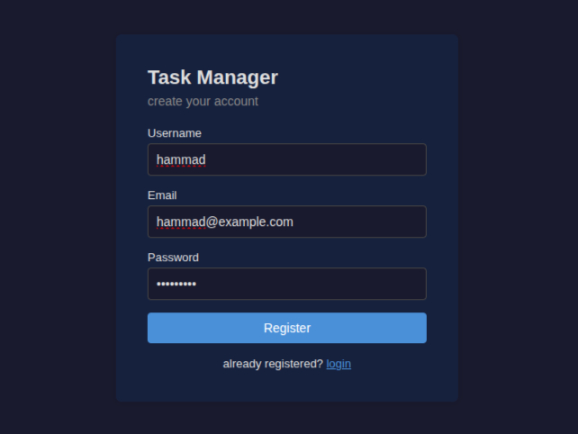
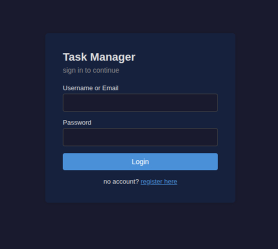
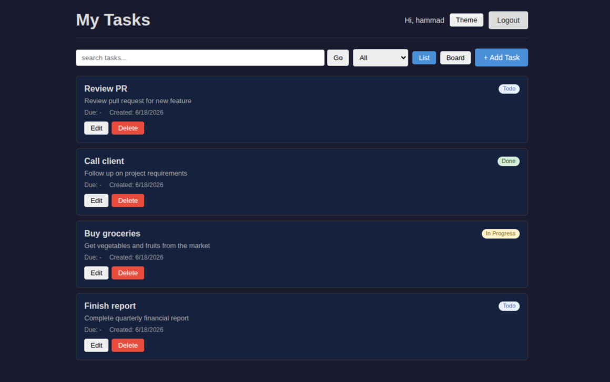
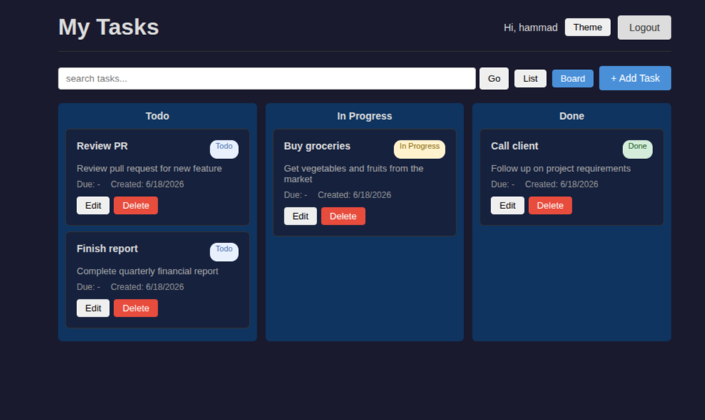
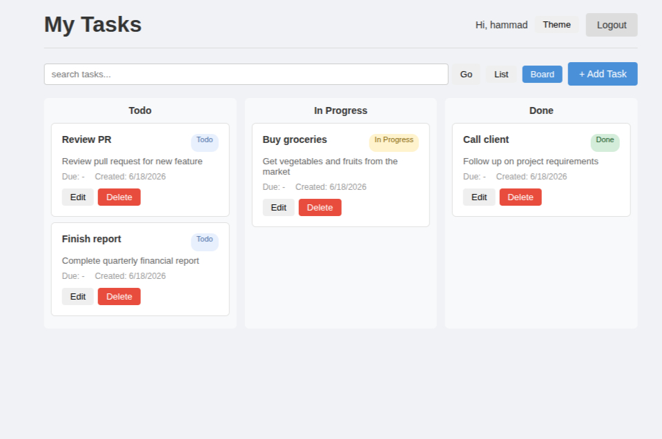

# Task Manager

This is a simple task management app I built. The backend is in Python (FastAPI)
and the frontend is in React. A user can create an account, log in, and add/edit/delete
their own tasks.

## Features

- Register and Login (JWT token)
- Create, edit, delete tasks
- Search by title
- Filter by status (Todo, In Progress, Done)
- Pagination
- Board view with drag and drop to change status
- Dark mode
- Looks fine on mobile too

## How to run

Start the backend first:

```
cd backend/venv
source bin/activate
pip install -r ../requirements.txt
cp .env.example .env
uvicorn main:app --reload --port 8000
```

The `.env` file holds the JWT secret key (there is a `.env.example` to copy from).

Backend runs on http://localhost:8000. You can also try the APIs from swagger:
http://localhost:8000/docs

Now in another terminal, the frontend:

```
cd frontend
npm install
npm run dev
```

Frontend opens on http://localhost:5173. Just open that in the browser.

(The frontend calls the backend on localhost:8000. If your port is different, set VITE_API_URL.)

## Screenshots

Register page:



Login page:



Dashboard (list view):



Board view (drag and drop):



Light theme (toggled with the theme button):



## APIs

All `/tasks` APIs need a token in the header like this:
`Authorization: Bearer <token>`

- POST /register  -> creates an account (json: username, email, password)
- POST /login     -> returns a token (form data: username, password). email also works here
- POST /tasks     -> new task
- GET  /tasks     -> list of tasks. query: page, page_size, search, status
- GET  /tasks/{id} -> one task
- PUT  /tasks/{id} -> update
- DELETE /tasks/{id} -> delete

Login doesn't take json, it takes form data (the OAuth2 one). Everything else is json.

## Tests

There are some backend tests written with pytest:

```
cd backend/venv
source bin/activate
pytest tests/ -v
```

## Database

Uses SQLite. Two tables are created:

users -> id, username, email, password (hashed)
tasks -> id, title, description, status, due_date, created_at, user_id

Each user only sees their own tasks, not anyone else's.

## Notes

- username must be at least 3 characters, password at least 6
- status can only be Todo / In Progress / Done
- token expires after 24 hours
- description and due_date are both optional
- used SQLite because it needs no install/setup
- the secret key is kept in a .env file, not in the code
- backend code lives inside the backend/venv folder
